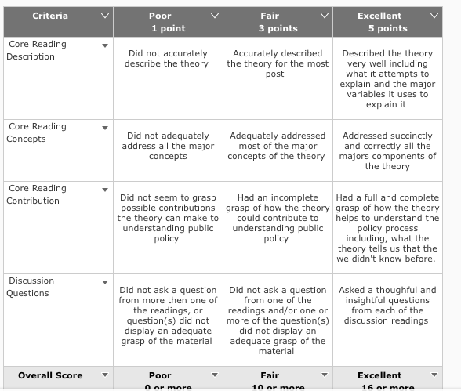

These are short papers that 1) provide a brief
summary (about 3 to 4 paragraphs) of the core readings and 2) provide at
least one discussion question for each of the discussion readings. In
your discussion papers you should summarize the main points and/or
theoretical concepts of the core readings and provide discussion
questions for the discussion readings in a way that shows your have read
and understand the material. **These are due before class**, in the
dropbox on [OAKS](https://lms.cofc.edu/).

Here is the rubric that will be used:

